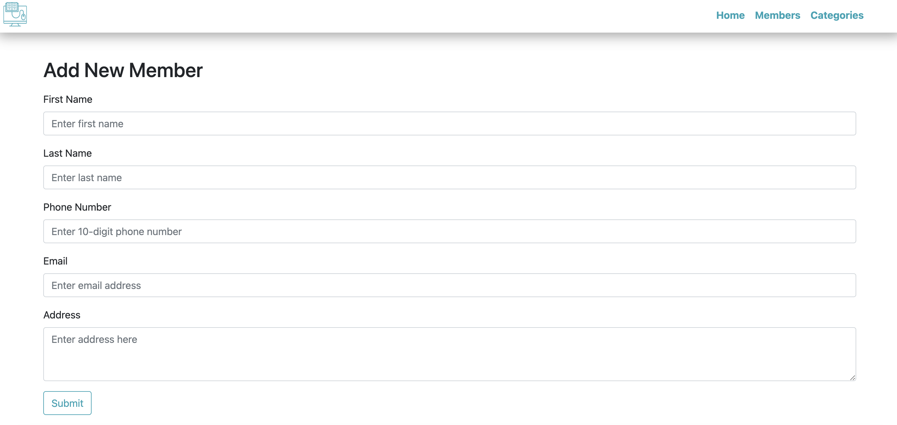
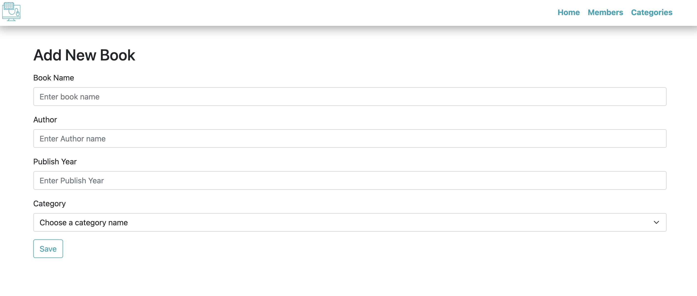
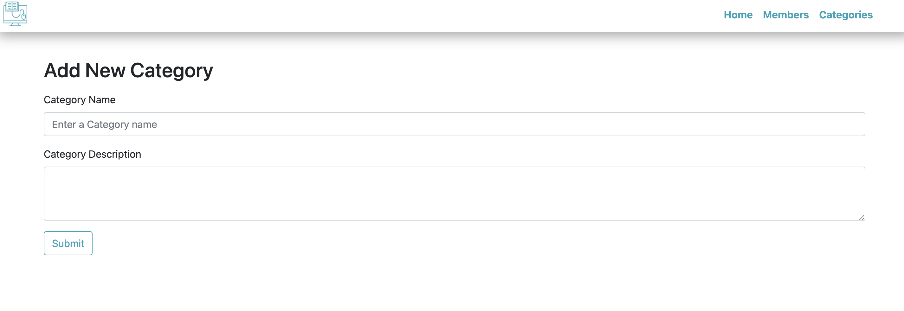
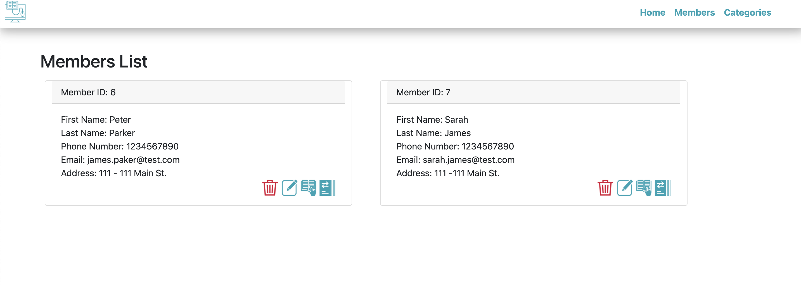
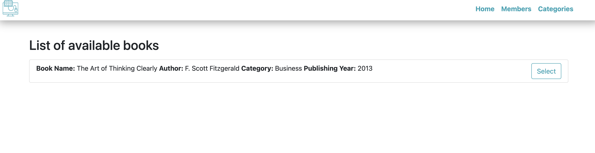
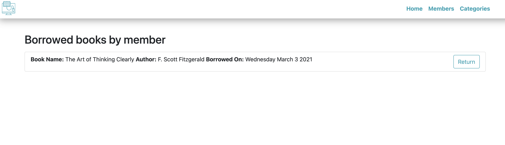

<h1 align="center", margin="2%">                     📚   Library Management System 📚</h1>

<h1>Description</h1>

    To build a management system that helps in handling the primary functions of libraries that involves 
    maintaining the database for entering new books and recording books that have been borrowed by members

<h1> Table of Contents </h1>

* [Demo](#Demo)

* [Installation](#installation)
  
* [Usage](#usage)

## Demo:

## Installation:
    1️⃣ Clone repository to your local ✔
    2️⃣ Run npm packages in (package.json) file ✔
    3️⃣ Copy code inside schema.sql file and run it in your mySQL server ❗️
    4️⃣ Copy seed.sql code and run it in your mySQL ❗️
    5️⃣ Run 'Node server' or 'npm start' to start application ✔
    
##  Usage:
    1️⃣ After running server ✔
    2️⃣ Add a member to library ✔
    3️⃣ Check the category list that you are interested ✔   
    4️⃣ Click member list and click barrow book icon under your name ✔
    5️⃣ After reading book click return book icon under your name ✔

<h3> Company name: TickTech IT Solutions  
Team Id: WD1404  
Domain of Project: Web Development  
</h3>

<h3> #TIS #ticktechitsolutions </h3>

   

